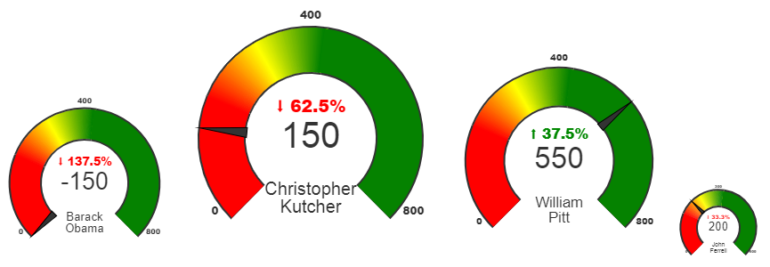

# Indicator JS

## Installation
Using NPM for use with TypeScript/JavaScript
```sh
$ npm install eshops-indicator
```

## Using

```html  
<canvas id="barack-indicator" width="200"></canvas>


<script src="dist/bundle.js"></script>
<script type="text/javascript">
    var indicator = new EshopsIndicator(document.getElementById("barack-indicator"), {
        current: "-150",
        previous: "400",
        title: "Barack Obama",
    });
    indicator.draw();
</script>

```


## Preview


[**Live Preview**](https://gebeto.github.io/web-projects/eshops-indicator/example.html)
